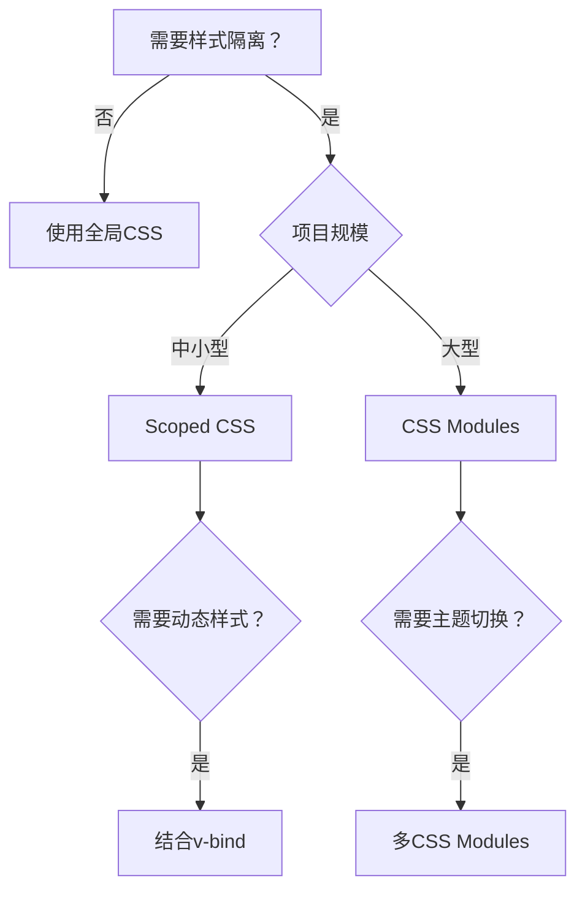

> 在大型 Vue 项目中，样式管理面临两大核心挑战：**避免全局污染**和**实现动态更新**。Vue 单文件组件通过多种创新方案解决了这些问题，本文将深入解析这些"黑魔法"的工作原理与最佳实践。

## 样式隔离的必要性

CSS 的全局特性在组件化开发中成为痛点：

- 类名冲突导致不可预测的样式覆盖
- 第三方库样式污染组件
- 多人协作时样式相互干扰

Vue 提供了两种主流隔离方案：

| 特性         | Scoped CSS                | CSS Modules            |
| ------------ | ------------------------- | ---------------------- |
| **隔离原理** | 属性选择器 (`data-v-xxx`) | 哈希类名 (`_3zyde4l1`) |
| **样式穿透** | `:deep()` 伪类            | 天然支持               |
| **动态绑定** | 原生支持 `v-bind()`       | 需结合 JS 变量         |
| **适用场景** | 中小型项目                | 大型复杂系统           |

## Scoped CSS 的运作机制

### 编译时转换原理

```vue
{/* 输入 */}
<style scoped>
.button {
  color: red;
}
</style>

{/* 输出 */}
<style>
.button[data-v-f3f3eg9] {
  color: red;
}
</style>
```

PostCSS 为组件内每个元素添加唯一 `data-v` 属性，形成**组件级样式沙箱**

### 作用域穿透技术

```css
/* 深度选择子组件元素 */
.parent :deep(.child) {
  border: 1px solid blue;
}

/* 样式化插槽内容 */
:slotted(.slot-content) {
  background: #f0f0f0;
}

/* 全局样式例外 */
:global(.ant-btn) {
  font-size: 16px;
}
```

> **穿透原理**：`:deep()` 移除当前组件的 `[data-v]` 属性限制，但保留父级作用域约束，实现**可控穿透**

## CSS Modules 的工程化应用

### 基础实现

```vue
<template>
  <p :class="$style.errorText">错误信息</p>
</template>

<style module>
.errorText {
  color: #f56c6c;
  font-weight: bold;
}
</style>
```

编译后生成唯一类名：`<p class="_2xHUc">`，彻底避免命名冲突

### 多主题方案

```vue
<script setup>
import { useCssModule } from "vue"

const light = useCssModule("light")
const dark = useCssModule("dark")
</script>

<template>
  <div :class="[light.container, dark.container]">...</div>
</template>

<style module="light">
.container {
  background: white;
}
</style>

<style module="dark">
.container {
  background: #333;
}
</style>
```

## 动态样式绑定技术

### CSS 变量绑定

```vue
<script setup>
const theme = reactive({
  primary: "#409EFF",
  padding: "12px",
})
</script>

<style scoped>
.button {
  background: v-bind("theme.primary");
  padding: v-bind("theme.padding");
}
</style>
```

编译为 CSS 变量：

```css
.button {
  background: var(--6b53742-primary);
  padding: var(--6b53742-padding);
}
```

### JS 与 CSS 联动

```vue
<script setup>
const scale = ref(1)

function zoomIn() {
  scale.value += 0.1
}
</script>

<template>
  <div class="box" @click="zoomIn">可缩放元素</div>
</template>

<style scoped>
.box {
  transform: scale(v-bind(scale));
  transition: transform 0.3s;
}
</style>
```

> **响应式原理**：当 `scale` 变化时，自动更新 `--*` 变量值，触发 CSS 重新渲染

## 性能优化与避坑指南

### 选择器优化策略

```css
/* 避免 */
nav ul li a {
  ...;
}

/* 推荐 */
.nav-link {
  ...;
}
```

- 保持选择器简洁（最大 3 级嵌套）
- 避免通用选择器 (`*`)

### 递归组件样式处理

```css
/* 危险：影响所有层级 */
.tree-node .child {
  margin-left: 20px;
}

/* 安全：仅影响直接子级 */
.tree-node > .child {
  margin-left: 20px;
}
```

### 样式复用方案

```vue
{/* base.css */}
@layer base { .text-ellipsis { overflow: hidden; text-overflow: ellipsis;
white-space: nowrap; } }

{/* 组件 */}
<style scoped>
.title {
  @apply text-ellipsis; /* Tailwind 兼容 */
  font-size: v-bind("fontSize");
}
</style>
```

## 架构选型建议

### 方案决策树



### 混合应用模式

```vue
<style module>
/* 基础样式 */
</style>

<style scoped>
/* 动态样式 */
</style>

<style>
/* 全局覆盖 */
</style>
```

> **工程实践真言**：
>
> - 中小项目首选 **Scoped CSS + v-bind**
> - 大型系统采用 **CSS Modules + JS 变量**
> - 避免深度选择器嵌套，保持 O(1) 选择器复杂度
> - 动态样式优先使用 CSS 变量而非 JS 操作 DOM

通过合理运用 Vue 的样式管理机制，开发者能在保证性能的前提下，构建出灵活可维护的现代化 UI 组件体系。
