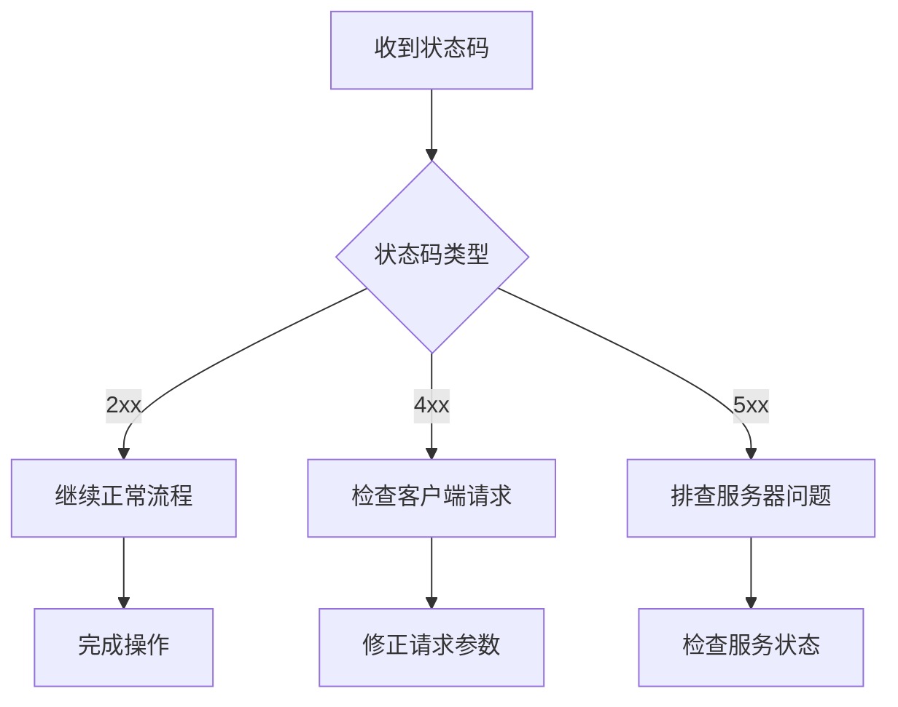
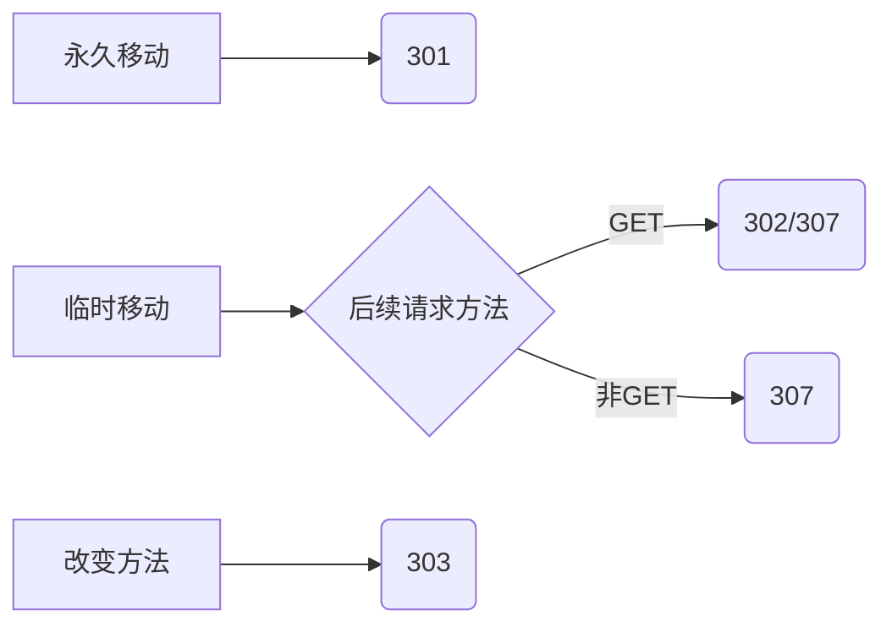
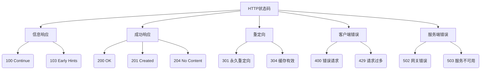

> 当你在浏览器输入网址按下回车，一场无声的对话正在发生。服务器用三位数字回应着每个请求——这些 HTTP 状态码是互联网世界的通用语言，无论你是开发者、运维工程师还是产品经理，理解它们都能让你在数字世界中如鱼得水。

## 为什么这些数字代码如此重要？

### 1. 技术协作的通用语言

- **前端开发者**：精准处理用户界面反馈
- **后端工程师**：设计清晰的 API 响应规范
- **运维团队**：快速定位系统故障点
- **产品经理**：理解功能实现的边界条件

### 2. 效率提升的关键



### 3. 用户体验的隐形守护者

- 401 状态时自动跳转登录页
- 503 状态展示友好维护页面
- 429 状态提示用户稍后重试

## 五大类状态码全景解析

| 状态类别       | 数字范围 | 核心意义               | 常见状态码              |
| -------------- | -------- | ---------------------- | ----------------------- |
| **信息响应**   | 100-199  | 请求已收到，继续处理中 | 100, 101, 103           |
| **操作成功**   | 200-299  | 请求已成功处理         | 200, 201, 204, 206      |
| **重定向**     | 300-399  | 需要进一步操作完成请求 | 301, 302, 304, 307      |
| **客户端错误** | 400-499  | 请求包含错误或无法完成 | 400, 401, 403, 404, 429 |
| **服务端错误** | 500-599  | 服务器未能完成有效请求 | 500, 502, 503, 504      |

## 关键状态码深度剖析

### 1. 100 Continue：大文件上传的"绿灯"

```http
POST /upload-large-file HTTP/1.1
Host: example.com
Content-Length: 10000000
Expect: 100-continue

HTTP/1.1 100 Continue
```

**应用场景**：  
客户端发送大文件前先询问服务器是否接受，避免传输被拒造成的带宽浪费

### 2. 201 Created：资源创建的标准响应

```http
POST /projects HTTP/1.1
Content-Type: application/json

{"name": "新项目"}

HTTP/1.1 201 Created
Location: /projects/789
Content-Type: application/json

{"id": 789, "name": "新项目"}
```

**最佳实践**：

- 必须包含 Location 头部指向新资源地址
- 响应体推荐包含创建的资源表示

### 3. 304 Not Modified：缓存优化的核心

```http
GET /logo.png HTTP/1.1
Host: example.com
If-Modified-Since: Wed, 21 Oct 2025 07:28:00 GMT

HTTP/1.1 304 Not Modified
```

**工作原理**：  
当客户端缓存有效时，服务器返回 304 可节省约 80%的图片传输流量

### 4. 400 vs 422：参数错误的精确表达

| 状态码 | 适用场景                 | 示例          |
| ------ | ------------------------ | ------------- |
| 400    | 基础语法错误             | JSON 解析失败 |
| 422    | 语义错误（业务规则违反） | 用户名已存在  |

### 5. 429 Too Many Requests：流量控制的守护者

```http
HTTP/1.1 429 Too Many Requests
Retry-After: 60
X-RateLimit-Limit: 100
X-RateLimit-Remaining: 0
X-RateLimit-Reset: 1627833600
```

**关键头部**：

- `Retry-After`：建议重试等待时间（秒或日期）
- `X-RateLimit-*`：限流配额信息

### 6. 503 Service Unavailable：优雅的服务降级

```http
HTTP/1.1 503 Service Unavailable
Retry-After: 300
Content-Type: application/json

{
  "error": "service_maintenance",
  "message": "系统升级中，预计恢复时间：2025-01-23T08:00:00Z",
  "status": 503
}
```

**最佳实践**：

- 维护期间返回 503 而非 404
- 提供预计恢复时间
- 返回标准错误格式

## 状态码使用黄金法则

### 1. 精确性原则

- **避免滥用 200 处理错误**：
  ```json
  // 反模式
  {
    "status": 200,
    "error": "Invalid credentials"
  }
  ```
- **正确做法**：401 + 标准错误体

### 2. 安全与权限控制

| 状态码 | 安全含义     | 日志记录要求       |
| ------ | ------------ | ------------------ |
| 401    | 身份验证失败 | 记录 IP 和尝试次数 |
| 403    | 权限不足     | 记录用户和资源路径 |
| 404    | 资源不存在   | 防止路径枚举攻击   |

### 3. 重定向的正确选择



### 4. 监控告警策略

```yaml
# 监控系统配置示例
alert_rules:
  - name: server_errors_high
    condition: status:5xx > 5% of total
    severity: critical

  - name: client_errors_sudden_increase
    condition: rate(status:4xx[5m]) > 100
    severity: warning
```

## 跨职能团队协作指南

### 前端开发者

```javascript
// 全局错误处理示例
axios.interceptors.response.use(null, (error) => {
  const status = error.response?.status;

  switch (status) {
    case 401:
      store.dispatch("logout");
      break;
    case 429:
      showRateLimitAlert(error.response.headers);
      break;
    default:
      showGenericError(status);
  }

  return Promise.reject(error);
});
```

### 后端工程师

```python
# Flask 状态码返回最佳实践
@app.route('/projects', methods=['POST'])
def create_project():
    data = request.get_json()

    if not data:
        return {'error': 'Invalid JSON'}, 400  # 格式错误

    if Project.exists(data['name']):
        return {'error': 'Name already used'}, 422  # 语义错误

    project = Project.create(data)
    return project.to_dict(), 201, {'Location': f'/projects/{project.id}'}
```

### 运维工程师

```bash
# Nginx 自定义错误页面
error_page 404 /custom_404.html;
error_page 500 502 503 504 /maintenance.html;

# 限流配置
limit_req_zone $binary_remote_addr zone=api:10m rate=10r/s;

location /api/ {
    limit_req zone=api burst=20;
    proxy_pass http://backend;
}
```

## 状态码知识体系



## 结语：数字背后的网络哲学

HTTP 状态码不仅是技术规范，更是系统设计的哲学体现：

1. **精确沟通**：每个数字传递特定语义
2. **分层处理**：客户端与服务端的责任分离
3. **优雅降级**：在故障时提供最大可用性
4. **透明协作**：跨团队的统一沟通语言

> 当你在浏览器看到 404 页面时，记住这不仅是"未找到"的提示，更是整个互联网架构在对你说话。理解这些三位数的代码，就是理解数字世界如何运作的钥匙。

## 引用

1. **RFC**: [Response Status Codes](https://datatracker.ietf.org/doc/html/rfc7231#section-6)
2. **MDN**: [HTTP 响应状态码](https://developer.mozilla.org/zh-CN/docs/Web/HTTP/Reference/Status)
